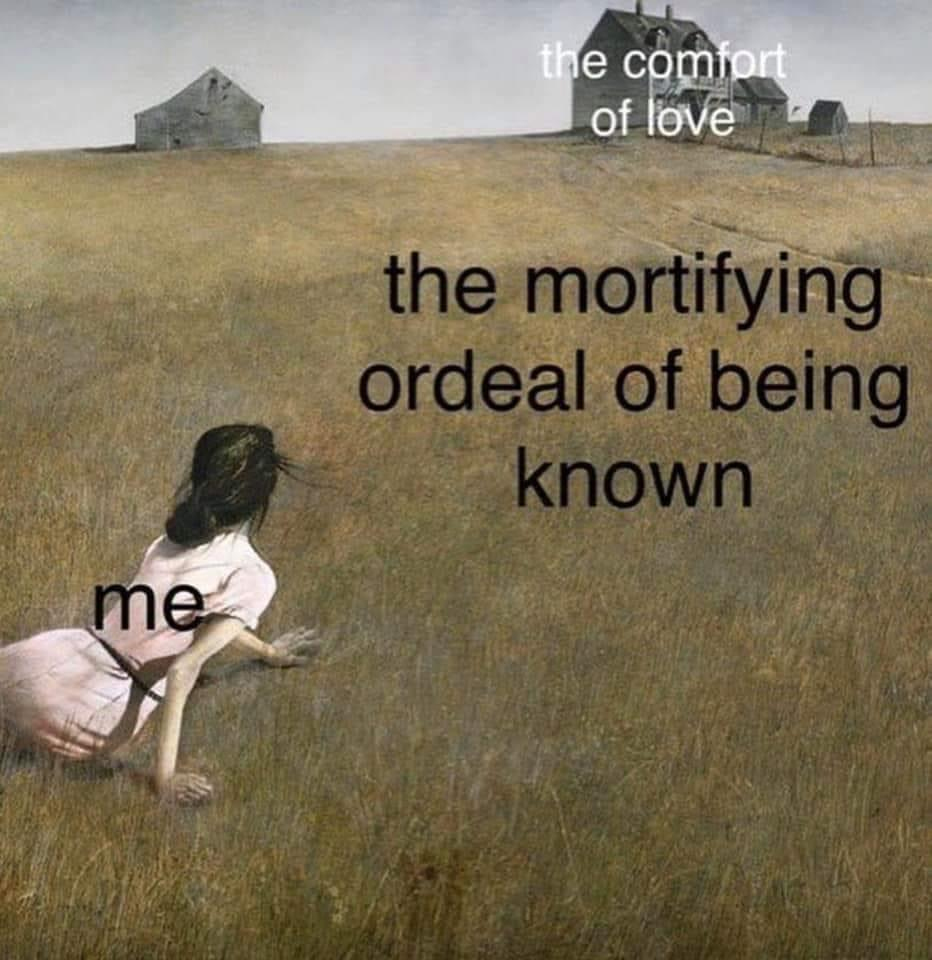

# Who I am?
Just unkown person that nobody knows and nobody should know, but for some reason I decided to
write this README.md since it can be useful sometime. I don't really like when people are trying to stalk me.

# Interests / Skills
* Windows/Linux/Hackintosh basic devops skills
* Webdev (few years of exprience, mainly python/django)
* Finding copy-pasta memes sorry code to implement own solutions
* Console modding (Sony - PSP, PS Vita, PS2, PS3)
* Thinkpad modding (jailbreaking)
* Playing PokemonGO - has been player for 4+ years
* In past I was rooting/jailbreaking phones, now I just don't do it anymore (proud owner of Samsung now)
* Drinking monsters in taste of mango loco
* Also - I was playing mmorpg and was addicted to them - but now this is not the case
* Rubiks Cube solver [almost sub 10] - mo100 around 11.00, top of 5% of speedcubers in the world

# Future projects?
Due to covid I became overweight and I have problems to manage todo something beside work,
but I want to provide websites and servers for amount of tasks, for example gaming solutions,
pokemongo social community collectors, etc.  
Now I just try to lose weight and I'm not addicted to sitting beside computer for 12-24 
(or even 30 hours) in stack as it was before. 
People started being more important for me than "just" devices.
So, gonna see in half year what I will do, but trust me, I will do something... I believe.